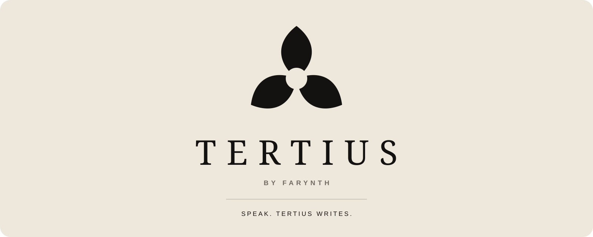

# Tertius

Local-first desktop dictation for macOS, Windows, and Linux.

Tertius records when you invoke it, transcribes speech on your computer, cleans the result, copies it to your clipboard, and writes it into the field you were using. It runs locally with no account, subscription, telemetry SDK, or cloud transcription service.

## Quick start

### Build it yourself

Install [Tauri 2's prerequisites](https://v2.tauri.app/start/prerequisites/) for your operating system, plus:

- Node.js 20 or newer
- Rust 1.85 or newer through [rustup](https://rustup.rs/)
- Git

Then clone and run Tertius:

```bash
git clone https://github.com/jollyzachary/tertius.git
cd tertius/apps/desktop
npm ci
npm run tauri dev
```

On first use, choose **Set up Tertius**. The app downloads and verifies a 478 MB local speech model. After setup:

1. Allow microphone access when your operating system asks.
2. On macOS, allow Accessibility access if you want automatic insertion. Clipboard copy works without it.
3. Hold `Control + Option + V` on macOS, or `Control + Alt + V` on Windows and Linux.
4. Speak, then release. You can switch to press-on/press-off mode inside the app.

To create an unsigned local package instead of starting development mode:

```bash
npm run tauri build
```

Native bundles are written under `target/release/bundle/` at the repository root.

### Give this to your AI agent

Copy this prompt into Codex, Claude Code, or another coding agent with terminal access:

```text
Set up Tertius from https://github.com/jollyzachary/tertius on this computer.

Read README.md, docs/ARCHITECTURE.md, and docs/PRIVACY.md before changing anything. Detect the operating system and architecture, then verify Node.js 20+, Rust 1.85+, Git, and the official Tauri 2 prerequisites. Ask before installing system packages or changing operating-system permissions.

Clone the repository, run npm ci inside apps/desktop, and create an unsigned local build for this operating system. Keep credentials, downloaded models, user data, personal paths, and build artifacts out of Git. Preserve local transcription and the existing product behavior. Report the exact artifact path, commands used, and any platform-specific limitation. Stop before granting microphone or accessibility permissions so I can review those prompts myself.
```

## What it does

- Dictates into the text field you were already using.
- Supports hold-to-talk and press-on/press-off activation.
- Keeps a small, always-on-top voice widget available without taking focus from your work.
- Shows live microphone energy while listening and a separate processing animation while composing.
- Copies every finished dictation to the clipboard, even when automatic insertion is unavailable.
- Retains finished dictations locally for three days, then prunes them automatically.
- Formats spoken bullet lists, numbered lists, new lines, paragraphs, and explicit punctuation commands.
- Handles filler cleanup and the spoken correction phrase “scratch that.”
- Applies restrained formatting based on the active application category.
- Runs transcription locally with an ONNX Parakeet model.

Tertius identifies the active application, not the page, document, or field. Native email, messaging, notes, and development tools can receive small formatting differences. Browsers use neutral formatting because the app does not inspect browser tabs or page content.

## The interaction

The default shortcut is designed to be reachable with one hand:

| Platform | Shortcut | Default behavior |
|---|---|---|
| macOS | `Control + Option + V` | Hold to listen, release to compose |
| Windows | `Control + Alt + V` | Hold to listen, release to compose |
| Linux | `Control + Alt + V` | Hold to listen, release to compose |

The floating voice widget can also start and stop dictation. It stays above other windows, expands on hover, can be moved, and remembers its screen position. Closing the main window hides it while Tertius continues running in the tray or menu bar.

## Privacy and data

The short version:

- Audio is held in memory during a dictation and is not written to disk.
- Speech recognition and cleanup run locally.
- Finished text, duration, word count, timestamp, and active application name are stored locally for three days.
- The selected activation mode and speech model identifier are stored locally.
- The speech model is downloaded once over HTTPS and verified against a pinned SHA-256 before extraction.
- Tertius runs without an account system, analytics SDK, advertising SDK, crash reporter, updater, or remote transcription endpoint.

Clipboard managers, cloud clipboards, and the destination application can still receive text after Tertius copies or inserts it. See [Privacy](docs/PRIVACY.md) for the complete data boundary, storage locations, deletion instructions, and network behavior.

## Permissions

| Permission | Why it is needed | Without it |
|---|---|---|
| Microphone | Capture audio while dictation is active | Tertius cannot transcribe speech |
| Accessibility on macOS | Send the paste shortcut to the previously focused app | The result remains copied to the clipboard |
| Desktop microphone access on Windows | Allow native applications to use the input device | Tertius cannot transcribe speech |
| Desktop input access on Linux | Send the paste shortcut in the current session | The result remains copied to the clipboard |

Tertius does not bypass operating-system or company security policy. Unsigned local rebuilds can appear as a new application identity, which may cause macOS to request Accessibility access again.

## Platform availability

| Platform | Availability | Notes |
|---|---|---|
| macOS 13+, Apple silicon | Supported | Reference build and package target |
| macOS 13+, Intel | Experimental | Builds from the shared macOS source |
| Windows 10/11, x64 | Experimental | Native Tauri build with DirectML option |
| Linux, x64 on X11 | Experimental | Native Tauri build with desktop-session dependencies |
| Linux on Wayland | Limited | Shortcut and synthetic input support varies by compositor |

Supported targets receive release-grade native checks. Experimental targets share the product implementation and welcome platform-specific testing and contributions. Tauri creates native bundles on the host operating system, so each target must be packaged on its own platform.

## Architecture

```text
global shortcut or voice widget
    -> CPAL microphone capture
    -> 16 kHz mono audio in memory
    -> local ONNX Parakeet inference
    -> deterministic cleanup and app-category formatting
    -> clipboard copy and automatic insertion
    -> three-day local transcript history
```

The product core is Rust. Tauri 2 provides native windows, packaging, tray integration, and the bridge to a React and TypeScript interface.

| Path | Responsibility |
|---|---|
| `crates/tertius-core` | Settings, transcript history, model catalog, and deterministic cleanup |
| `apps/desktop/src-tauri` | Audio, shortcuts, inference, insertion, permissions, persistence, tray, and native windows |
| `apps/desktop/src` | Main interface and floating voice widget |
| `docs` | Architecture, privacy, design research, and troubleshooting |

Read [Architecture](docs/ARCHITECTURE.md) for the runtime state machine, cancellation boundary, formatting rules, and cross-platform tradeoffs.

## Local acceleration

The default build uses the CPU. Optional ONNX Runtime execution providers are exposed as Cargo features:

| Feature | Intended host |
|---|---|
| `coreml` | macOS |
| `directml` | Windows |
| `cuda` | Windows or Linux with NVIDIA runtime dependencies |
| `rocm` | Linux with AMD runtime dependencies |
| `webgpu` | Windows or Linux |
| `xnnpack` | Optimized CPU path |

Examples:

```bash
# macOS
npm run tauri build -- --features coreml

# Windows
npm run tauri build -- --features directml

# Windows or Linux with the required NVIDIA runtime
npm run tauri build -- --features cuda
```

Accelerated builds must be verified on the hardware and driver stack that will run them. The CPU path remains the compatibility default.

## Development

Run commands from `apps/desktop` unless noted otherwise:

```bash
npm ci                    # install the locked frontend toolchain
npm run tauri dev         # start the native development app
npm run build             # type-check and build the frontend
npm run tauri build       # create an unsigned native package
```

Rust checks run from the repository root:

```bash
cargo fmt --all -- --check
cargo check --workspace
```

Signing credentials do not belong in this repository. Local builds are unsigned by default. Maintainers should supply signing and notarization material through a private environment using [Tauri's platform signing guidance](https://v2.tauri.app/distribute/sign/).

## Model integrity and attribution

Tertius downloads `parakeet-v3-int8.tar.gz` from the model location documented by [`transcribe-rs`](https://github.com/cjpais/transcribe-rs). The expected archive is 478,517,071 bytes with this SHA-256:

```text
43d37191602727524a7d8c6da0eef11c4ba24320f5b4730f1a2497befc2efa77
```

The Parakeet TDT 0.6B v3 model originates from NVIDIA and is available under CC BY 4.0. Review the [official model card](https://huggingface.co/nvidia/parakeet-tdt-0.6b-v3) for supported languages, license terms, and model limitations. See [Third-party notices](THIRD_PARTY_NOTICES.md) for bundled font attribution.

## Roadmap

Tertius 0.1 concentrates on the complete local desktop dictation loop. The roadmap includes:

- Release-grade Windows and Linux packages.
- Signed and notarized distribution across supported platforms.
- Immediate hard cancellation through an isolated inference worker.
- Broader Wayland shortcut and input support.
- Reproducible multilingual and long-dictation evaluation.

See [Troubleshooting](docs/TROUBLESHOOTING.md) before filing a bug. The interaction and technology choices are documented in [Design research](docs/RESEARCH.md).

## Contributing and security

Read [Contributing](CONTRIBUTING.md) before opening a pull request. Review the [Security policy](https://github.com/jollyzachary/tertius/security/policy) and [report vulnerabilities privately](https://github.com/jollyzachary/tertius/security/advisories/new) through GitHub.

## License

The source code is available under the [MIT License](LICENSE). The Tertius and Farynth names, logos, and visual identity are not licensed for use as a source identifier for another product. See [Trademarks](TRADEMARKS.md).
